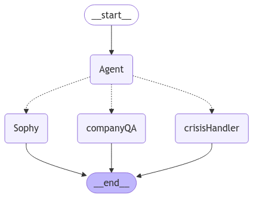

# Sophy: A Mental Health Support Chatbot with Q&A and Crisis Handling

Sophy is a mental health assistant chatbot designed to provide empathetic and calm support to users, assist with queries about the company, and guide users in crisis situations to appropriate resources. The bot uses a state graph to dynamically handle various routes for user conversations.

---

## Table of Contents

1. [Features](#features)
2. [Technologies Used](#technologies-used)
3. [Installation](#installation)
4. [Usage](#usage)
5. [How It Works](#how-it-works)
6. [Future Improvements](#future-improvements)

---

## Features

- **Empathetic Mental Health Support**: Chat with a virtual assistant trained to provide calm and concise responses to common mental health concerns like stress, anxiety, and low moods.
- **Crisis Helpline**: Automatically detect potentially harmful situations and direct users to a crisis helpline.
- **Company Q&A**: Provide concise and accurate answers to company-specific queries using a document-based retrieval system.
- **Dynamic Conversation Management**: Sophy uses a state graph to manage user conversations and select the appropriate response route.

---

## Technologies Used

- **Python**: Core programming language for the application.
- **LangChain**: Framework for managing conversations and prompts.
- **LangChain-Ollama**: Used for embeddings and vector store implementation.
- **FAISS**: Vector store for document retrieval.
- **LangGraph**: For building and managing the conversation state graph.
- **Large Language Models**: Powered by the `llama3.2:1b` model via Ollama.

---

## Installation

1. Clone the repository:
   ```bash
   git clone https://github.com/rs-saran/serene-solace-sophy.git
   ```
2. Create python venv
```bash
py -m venv "sss-enc
```

3. Activate python venv

4. Install dependencies:
   ```bash
   pip install -r requirements.txt
   ```

5. Install Ollama and pull llama3.2:1b model

---

## Usage

1. Run Ollama

2. Run the chatbot:
   ```bash
   python main.py
   ```

3. Interact with Sophy:
   - Input your queries or concerns.
   - Type "exit" or "quit" to end the session.

4. [Example chat](./example_chat.txt)

---

## How It Works



1. **State Graph**:
   - Sophy uses `langgraph` to build a state graph.
   - The graph manages transitions between nodes: `Agent`, `Sophy`, `CompanyQA`, and `CrisisHandler`.

2. **Agent Node**:
   - Determines the appropriate route based on user input:
     - `continue_chat`: Normal conversation for mental health support.
     - `crisis_helpline`: Directs the user to a crisis helpline.
     - `company_qa`: Answers company-related queries.

3. **Sophy**:
   - Uses llama3.21b model to chat empathetically.
   - Dynamically summarizes ongoing exchanges to maintain context and improve conversation flow.

4. **Company Q&A**:
   - Leverages FAISS for document retrieval and answers user questions based on the `company.md` file.

5. **Crisis Handling**:
   - Provides a helpline number if harmful intent is detected.

---

## Future Improvements

- Smoother integration between flows
- UI for the chat
- Expand the knowledge base for company Q&A.
- Enhance the detection mechanism for harmful intent.

---